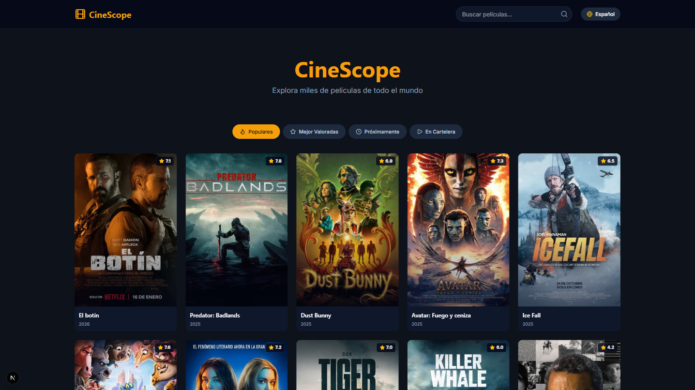
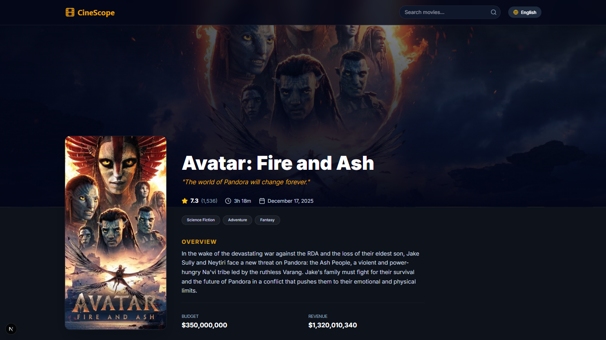
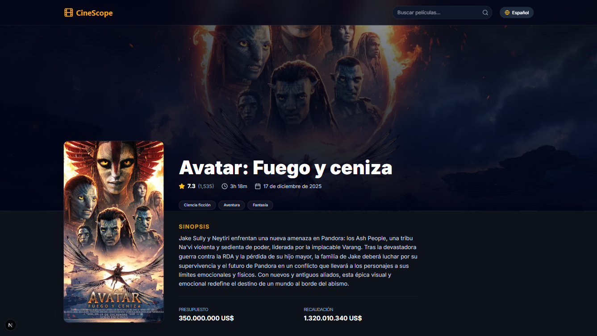
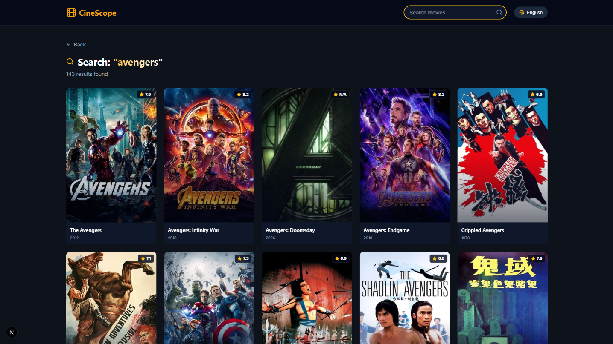
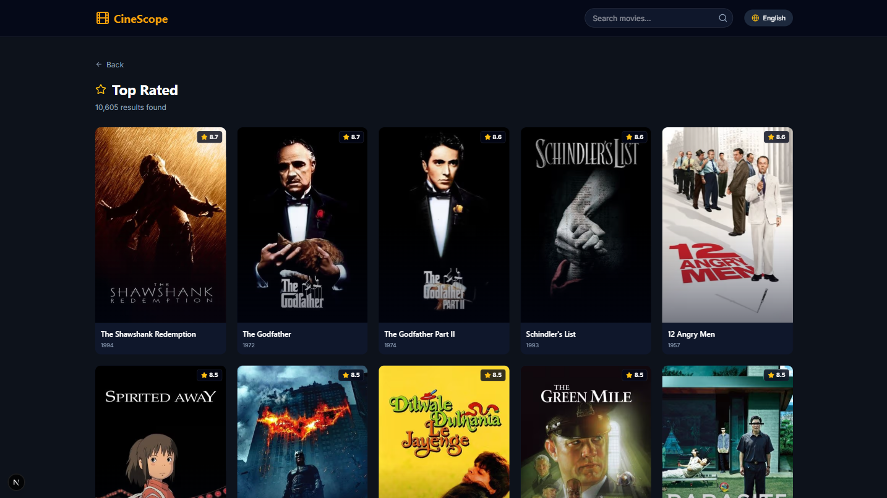
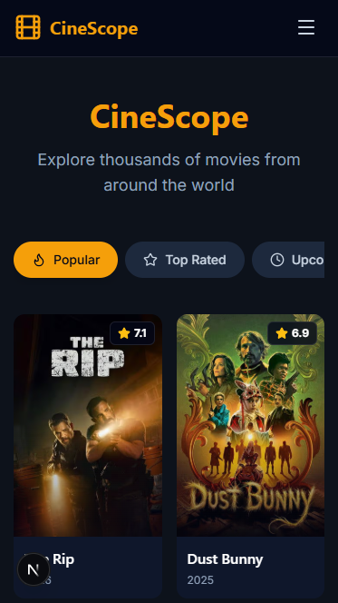

# CineScope Movie Explorer

A modern, responsive movie discovery application built with Next.js, TypeScript, and Tailwind CSS. This app integrates with The Movie Database (TMDB) API to allow users to browse popular movies, search for titles, and view detailed movie information in multiple languages.

## 🚀 Features

- **Movie Discovery**: Browse popular, top-rated, upcoming, and now playing movies
- **Search Functionality**: Search for movies by title with real-time results
- **Movie Details**: View comprehensive movie information including ratings, runtime, budget, and more
- **Internationalization (i18n)**: Full support for English and Spanish with URL-based locale routing
- **Responsive Design**: Seamless experience across mobile, tablet, and desktop devices
- **Modern UI**: Cinematic dark theme with smooth animations and transitions

## 🛠️ Tech Stack

| Technology             | Purpose                   |
| ---------------------- | ------------------------- |
| Next.js 15             | Framework with App Router |
| React 18               | UI Framework              |
| TypeScript             | Type Safety               |
| Tailwind CSS           | Styling                   |
| React Query (TanStack) | Data Fetching & Caching   |
| next-intl              | Internationalization      |
| Lucide React           | Icons                     |

## 📁 Project Structure

```
src/
├── app/                        # Next.js App Router
│   ├── [locale]/               # Dynamic language segment
│   │   ├── layout.tsx          # i18n & Shared UI (Header/Footer)
│   │   ├── page.tsx            # Home Page
│   │   ├── not-found.tsx       # Custom 404
│   │   ├── movie/
│   │   │   └── [id]/
│   │   │       └── page.tsx    # Movie Details Page
│   │   ├── search/
│   │   │   └── page.tsx        # Search Results Page
│   │   ├── popular/
│   │   │   └── page.tsx        # Popular Movies Page
│   │   └── top-rated/
│   │       └── page.tsx        # Top Rated Movies Page
│   ├── globals.css             # Global styles
│   └── layout.tsx              # Root Layout
├── components/                 # React components
│   ├── home/                   # Homepage components
│   │   ├── CategoryFilter.tsx
│   │   └── CategoryManager.tsx
│   ├── layout/                 # Layout components
│   │   ├── Footer.tsx
│   │   └── Header.tsx
│   ├── movie/                  # Movie components
│   │   ├── MovieCard.tsx
│   │   ├── MovieGrid.tsx
│   │   ├── MovieDetailsPage.tsx
│   │   ├── MovieDetailsHero.tsx
│   │   └── MovieDetailsInfo.tsx
│   ├── providers/              # Context providers
│   │   └── ReactQueryProvider.tsx
│   └── ui/                     # Reusable UI components
│       └── Pagination.tsx
├── lib/                        # Shared utilities
│   ├── api/                    # TMDB API logic
│   │   ├── config.ts
│   │   ├── movies.ts
│   │   ├── types.ts
│   │   └── useMovies.ts        # React Query hooks
│   ├── i18n/                   # Internationalization
│   │   ├── request.ts
│   │   └── routing.ts
│   └── utils.ts                # Helper functions
└── messages/                   # Translation JSON files
    ├── en.json
    └── es.json
```

## 🚦 Getting Started

### Prerequisites

- Node.js 18+
- npm or yarn

### Installation

1. **Clone the repository**

   ```bash
   git clone <repository-url>
   cd cinescope-movie-explorer
   ```

2. **Install dependencies**

   ```bash
   npm install
   ```

3. **Start the development server**

   ```bash
   npm run dev
   ```

4. **Open the application**
   Navigate to `http://localhost:3000` in your browser

## 🔑 Environment Setup (TMDB API Key)

Create a `.env.local` file in the project root (this file should not be committed) with your TMDB API key:

```env
NEXT_PUBLIC_TMDB_API_KEY=your_api_key_here
NEXT_PUBLIC_TMDB_BASE_URL=https://api.themoviedb.org/3
NEXT_PUBLIC_TMDB_IMAGE_BASE_URL=https://image.tmdb.org/t/p
```

The application is already configured to use these environment variables in `src/lib/api/config.ts`.

**Security Note**: In a production environment, consider proxying API requests through a backend to protect your API key from exposure in client-side code.

## 🌐 Internationalization

The app supports English and Spanish with URL-based locale routing:

| Language | URL Pattern | Example         |
| -------- | ----------- | --------------- |
| English  | `/en/...`   | `/en/movie/550` |
| Spanish  | `/es/...`   | `/es/movie/550` |

The language switcher in the header allows users to switch between languages, which updates both the UI and TMDB API responses.

## 🎨 Design System

The app uses a custom cinematic dark theme defined in `src/app/globals.css`:

- **Primary Color**: Gold (`#f59f0a` / `oklch(0.84 0.17 84)`) for highlights and CTAs
- **Background**: Dark gray (`#171717`) and Cinema Surface (`oklch(0.18 0.02 262)`) for immersive feel
- **Typography**: Inter for body text, Space Grotesk for headings
- **Effects**: Spotlight gradients, glow shadows, smooth animations

## 📸 Screenshots

### Homepage (English)


_Main discovery page showing popular movies with category navigation_

### Homepage (Spanish)


_Página principal mostrando películas populares con navegación por categorías_

### Movie Details Page (English)


_Detailed movie information including poster, ratings, overview, and metadata_

### Movie Details Page (Spanish)


_Información detallada de la película incluyendo póster, calificaciones, sinopsis y metadatos_

### Search Results (English)


_Search functionality showing filtered movie results_

### Popular Movies Page (English)


_Category-specific page showing top rated movies in grid layout_

### Mobile Responsive Design


_Responsive design optimized for mobile devices_

_Screenshots captured on desktop (1920x1080) and mobile (375x667) viewports_

## 🧪 Tech Decisions

### Why Next.js App Router?

- Built-in server-side rendering for better SEO
- Improved performance with streaming and caching
- Better code organization with layout nesting
- Native support for internationalization

### Why React Query?

- Automatic caching reduces API calls
- Built-in loading and error states
- Background refetching keeps data fresh
- Excellent TypeScript support

### Why Tailwind CSS?

- Rapid UI development with utility classes
- Consistent spacing and sizing
- Easy dark mode support
- Small production bundle with purging

### Why next-intl?

- Seamless integration with Next.js App Router
- Type-safe translation keys
- URL-based routing for SEO
- Server-side rendering support

## 📝 Available Scripts

| Command         | Description              |
| --------------- | ------------------------ |
| `npm run dev`   | Start development server |
| `npm run build` | Build for production     |
| `npm run start` | Start production server  |
| `npm run lint`  | Run ESLint               |

## 📄 License

This project is open source and available under the MIT License.

## 🙏 Acknowledgments

- [TMDB](https://www.themoviedb.org/) for providing the movie data API
- [Lucide](https://lucide.dev/) for beautiful icons
